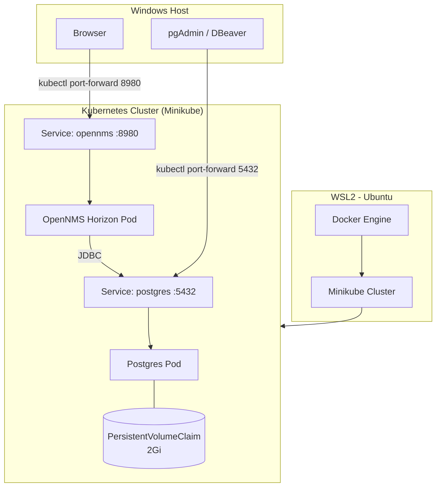

# OpenNMS on Kubernetes (Minikube) — Network Monitoring Lab

A self-contained lab that deploys **OpenNMS Horizon**, a network monitoring platform, on a local **Kubernetes (Minikube)** cluster with a **PostgreSQL** backend — provisioned, exposed, and validated end-to-end via node discovery.

## Why this project

In my day-to-day role I work with OpenNMS in a telecom OSS environment. I built this lab to go one level deeper: understand how a stateful, multi-component monitoring application like OpenNMS is actually deployed and operated on Kubernetes — persistent storage, service discovery, health checks, and the trade-offs between a "make it work" lab setup and a production-ready one.

## Architecture



**Flow:** Docker Engine (inside WSL2) runs the Minikube cluster → Postgres pod starts first and claims persistent storage → OpenNMS pod starts, waits on a readiness probe, and connects to Postgres over the internal `postgres` service → both apps are exposed to the Windows host via `kubectl port-forward` for browser/DB-client access.

## Tech Stack

| Layer | Tool |
|---|---|
| Host environment | WSL2 (Ubuntu) |
| Container runtime | Docker Engine |
| Orchestration | Kubernetes (Minikube) |
| Monitoring application | OpenNMS Horizon |
| Database | PostgreSQL 15 |
| Secrets | Kubernetes `Secret` |

## What this validates

- Stateful app deployment on Kubernetes with a `PersistentVolumeClaim`
- Service-to-service communication inside a cluster (OpenNMS → Postgres over the internal service name)
- Dependency-ordered startup (Postgres ready before OpenNMS starts) using readiness probes
- End-to-end functional validation: a test requisition and node were provisioned through the OpenNMS UI and successfully synchronized — confirmed by the **"Nodes in Database" count going from 0 to 1**

## Repository Structure

```
.
├── README.md
├── k8s/
│   ├── secret.yaml                  # Credential template (do not commit real values)
│   ├── postgres-deployment.yaml     # Postgres Deployment + PVC + Service
│   └── opennms-deployment.yaml      # OpenNMS Deployment + Service
└── docs/
    └── SETUP.md                     # Full step-by-step setup guide
```

## Quick Start

```bash
# 1. Start Minikube
minikube start --driver=docker

# 2. Create the Postgres credentials secret (see k8s/secret.yaml for details)
kubectl create secret generic postgres-credentials \
  --from-literal=POSTGRES_USER=opennms \
  --from-literal=POSTGRES_PASSWORD=<your-password> \
  --from-literal=POSTGRES_DB=opennms

# 3. Deploy Postgres, then OpenNMS (order matters)
kubectl apply -f k8s/postgres-deployment.yaml
kubectl apply -f k8s/opennms-deployment.yaml

# 4. Expose services locally
kubectl port-forward svc/postgres 5432:5432 &
kubectl port-forward svc/opennms 8980:8980 &

# 5. Open OpenNMS
# http://localhost:8980/opennms  (default: admin / admin)
```

Full step-by-step instructions, including WSL2/Docker/Minikube/kubectl installation, are in [`docs/SETUP.md`](docs/SETUP.md).

## Production Considerations (deliberately out of scope for this lab)

This is a local lab, so a few things were intentionally simplified. In a production deployment, I would additionally:

- **Secrets management**: use a real secrets backend (e.g. Sealed Secrets, External Secrets Operator, or a cloud KMS-backed solution) instead of a plain `Secret` object
- **Default credentials**: change the default OpenNMS `admin/admin` login and enforce a credentials rotation policy
- **Image provenance**: pull from a private, scanned registry instead of Docker Hub directly, and pin digests (`@sha256:...`) rather than tags for full immutability
- **High availability**: run multiple OpenNMS/Postgres replicas with proper leader election / managed database (e.g. RDS) instead of a single pod with local PVC storage
- **Observability**: add Prometheus/Grafana to monitor the monitoring stack itself, plus log aggregation
- **Network policy**: restrict pod-to-pod traffic with `NetworkPolicy` resources instead of relying on default namespace-open access

## Known Limitations

- Single-replica, single-node (Minikube) — not designed for HA or load
- No automated CI/CD for manifest deployment (manual `kubectl apply`)
- No TLS termination on the exposed services

## License

MIT
